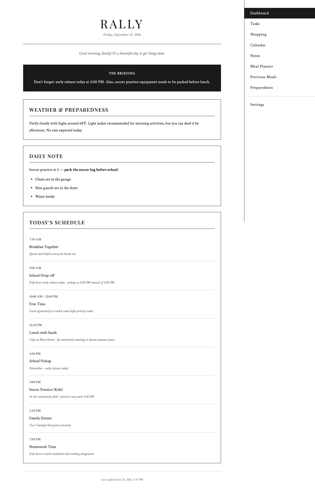
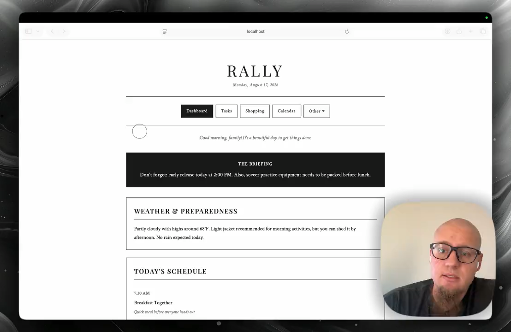
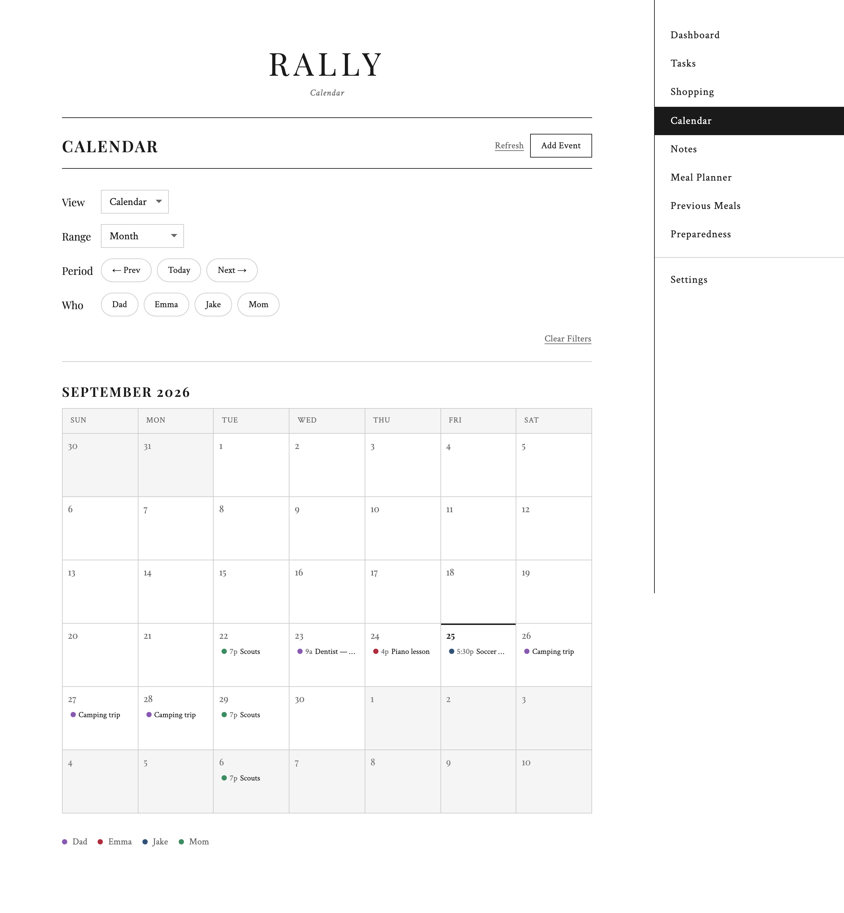
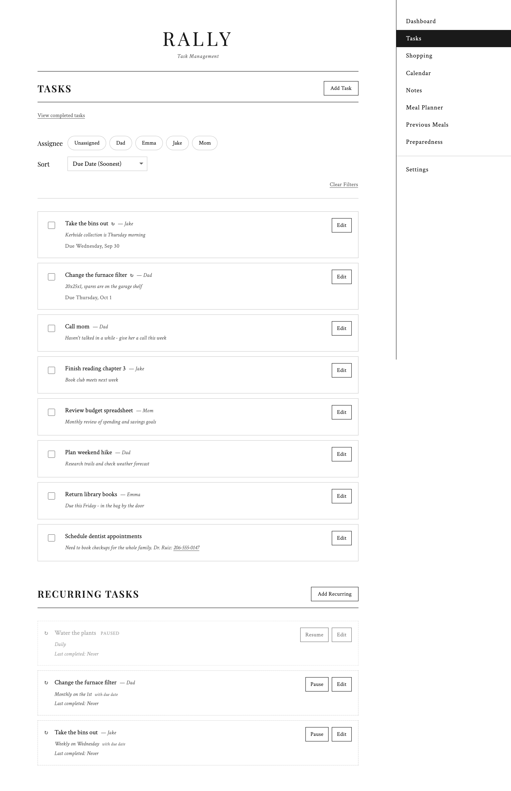
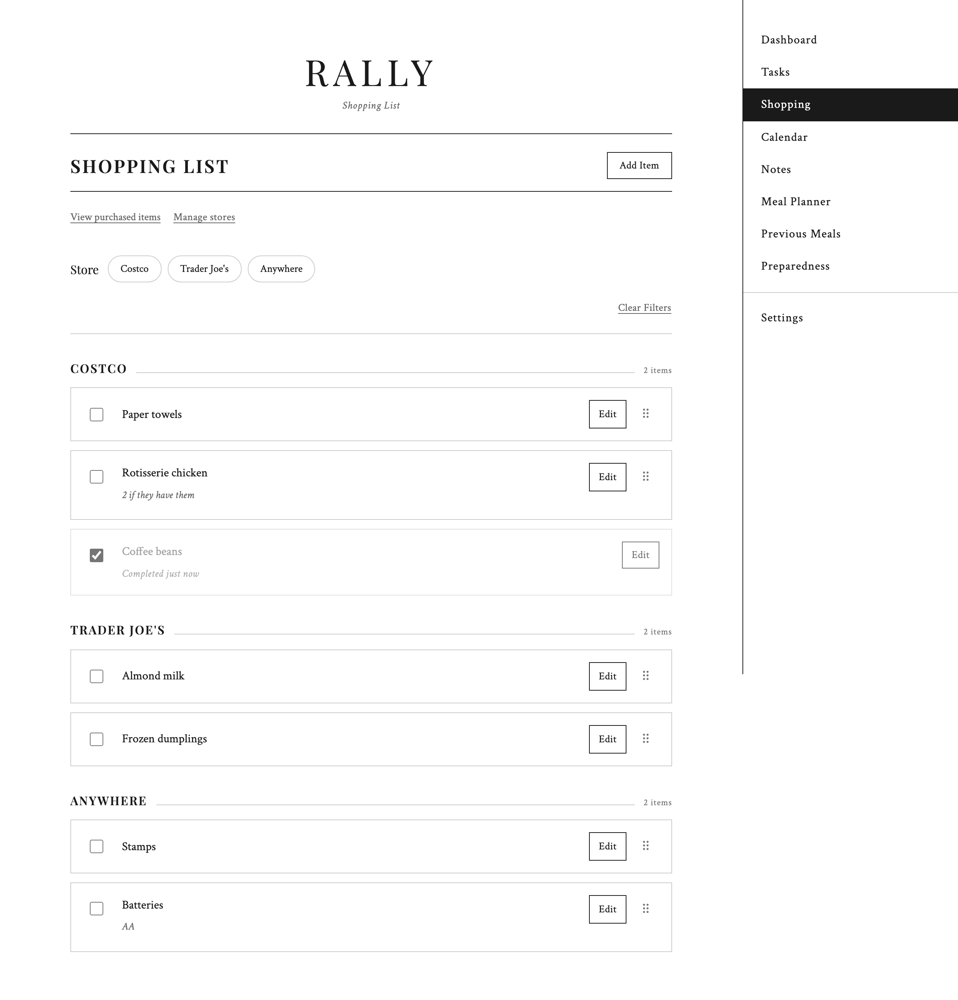
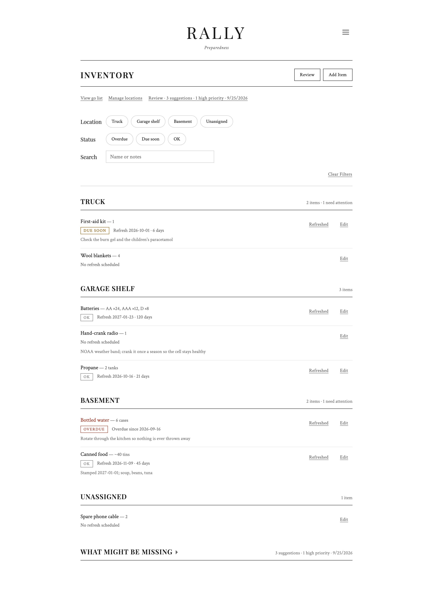
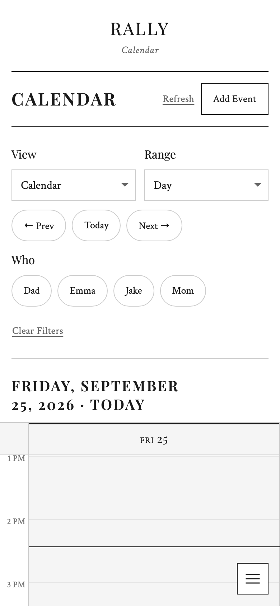

# Rally

**Your family's command center: one shared plan for the day, on every screen in the house.**

Rally is a self-hosted app for family logistics. Who is going where, what has to get done, what needs buying, and what is in the emergency kit. Every morning it reads your calendars, the weather forecast and your lists, and writes one short briefing for the whole family. The rest of the day it is the shared calendar, the task list, the shopping list and the stock inventory that the briefing was built from.

It runs on your own hardware. Your family's schedule stays in the house, apart from what goes to the AI provider you choose.



## Watch the tour

A ten-minute walk through the whole app, recorded against a seeded demo instance. Click through to watch it.

[](https://github.com/pid1/rally/releases/download/demo-2026-08-17/rally-demo.mp4)

You can run the same demo instance yourself in about a minute: see [docs/development.md](docs/development.md#the-demo-instance).

## What Rally does

### One briefing, every morning

At 4 AM Rally gathers the day's events, the forecast, the tasks that are due and tonight's dinner, then asks the AI model of your choosing to write the family a short plan in plain language. The page is served from a cache, so the kitchen display never sits waiting on an API.

You can fold in more if you want it: your open shopping list, anything overdue in your emergency stock, tonight's games for the teams you follow, a STEM idea for the kids. Each one is a toggle in Settings.

### A calendar the whole family shares

Rally holds your family's own events and shows them beside the calendars you already use, whether that's Google, iCloud, or any ICS feed. There are day, week, month and agenda views, colour-coded by person, with recurring events and per-occurrence edits (just this Tuesday, or every Tuesday from now on).



When somebody adds, moves or cancels an event, the people on that event get a push notification. The household doesn't. Reminders work the same way: put a lead time on an event and only its attendees hear about it.

### Tasks and shopping

Tasks can belong to a person, carry a due date, and repeat daily, weekly or monthly. Completed ones stay on the page until midnight, so nobody has to wonder whether the bins went out.



The shopping list is built for fast entry. It autocompletes from what the family has bought before, remembers which shop each thing comes from, and groups the list by shop so one trip fits on one screen. You can add to it by voice through Siri: see **[docs/voice-shortcuts.md](docs/voice-shortcuts.md)**.



### Emergency stock

Track what is in the kit, where it lives, and when it needs replacing. A replacement date can be fixed (this case is stamped 2027-01-01) or a rotation (swap the water every six months). Rally pushes one digest a day covering everything due, keeps mentioning anything overdue in the morning briefing, and prints a go list grouped by location in the order you walk it.



### On a phone

Every page is built for a phone first and scales up to a wall display. The design is greyscale and typographic, so it also reads well on e-ink.



## Getting started

Rally ships as a Docker container:

```bash
docker run -d \
  -p 8000:8000 \
  -v $(pwd)/data:/data \
  --name rally \
  --restart unless-stopped \
  ghcr.io/pid1/rally:latest
```

Open `http://localhost:8000/settings` and fill in your timezone, your family members, an AI provider key and a weather forecast URL. Everything else is optional and can be added later.

Full instructions, including what you need before you start: **[docs/installation.md](docs/installation.md)**.

## Documentation

| Guide | What's in it |
|---|---|
| [Installation](docs/installation.md) | Requirements, Docker deployment, upgrades, environment variables |
| [Configuration](docs/configuration.md) | Settings UI, AI providers, weather, calendars, Pushover notifications |
| [Voice shortcuts](docs/voice-shortcuts.md) | Adding shopping items with Siri and Apple Shortcuts |
| [Backups](docs/backup.md) | Scheduled, client-side-encrypted offsite backup |
| [Development](docs/development.md) | Local setup, commands, tests, database migrations, the demo instance |
| [Design system](docs/visual-design-system.md) | Typography, spacing, components and how they are enforced |

## Contributing

Pull requests are welcome. Run `check` and the test suite before submitting, as described in [docs/development.md](docs/development.md).

If you are an AI agent working in this repository, read **[AGENTS.md](AGENTS.md)** first.

## License

BSD 3-Clause. See [LICENSE](LICENSE).
