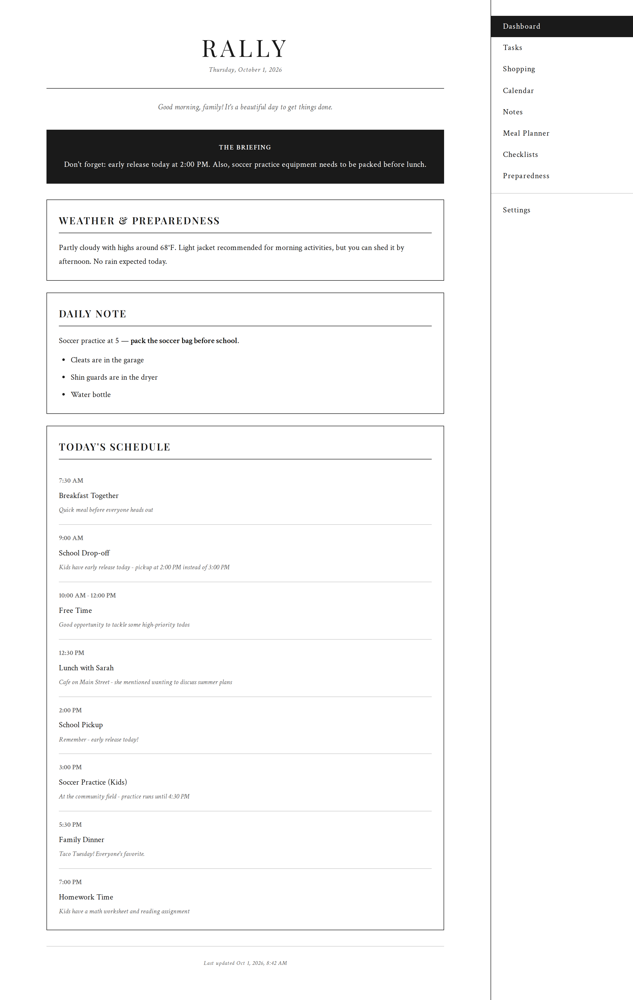
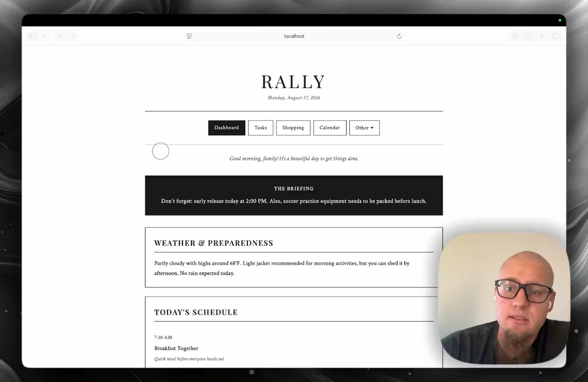
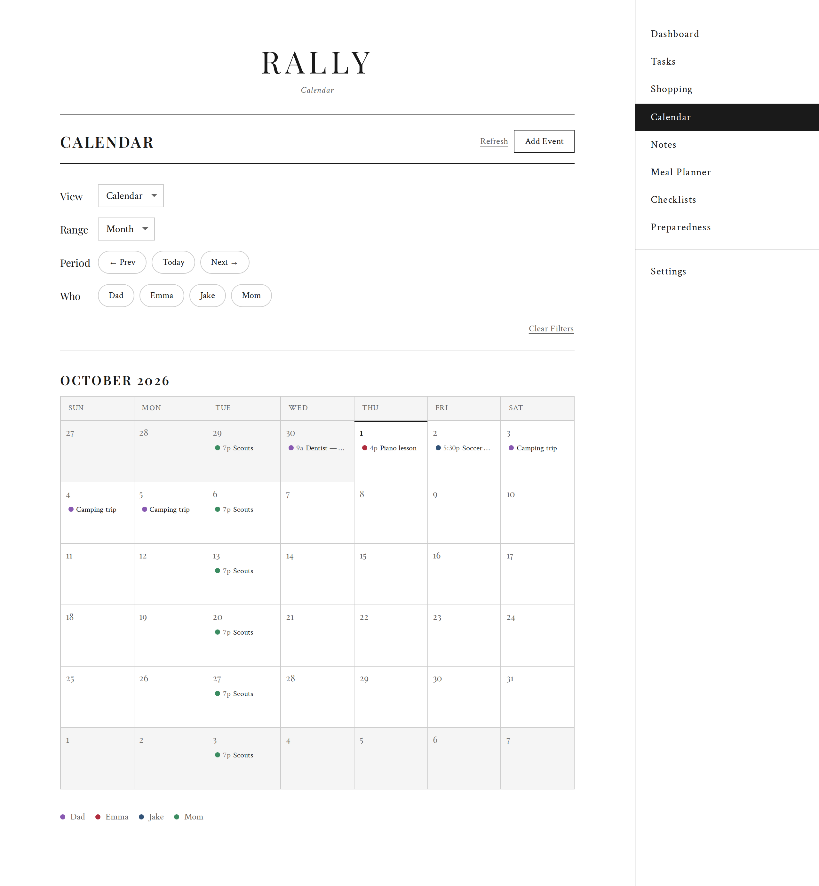
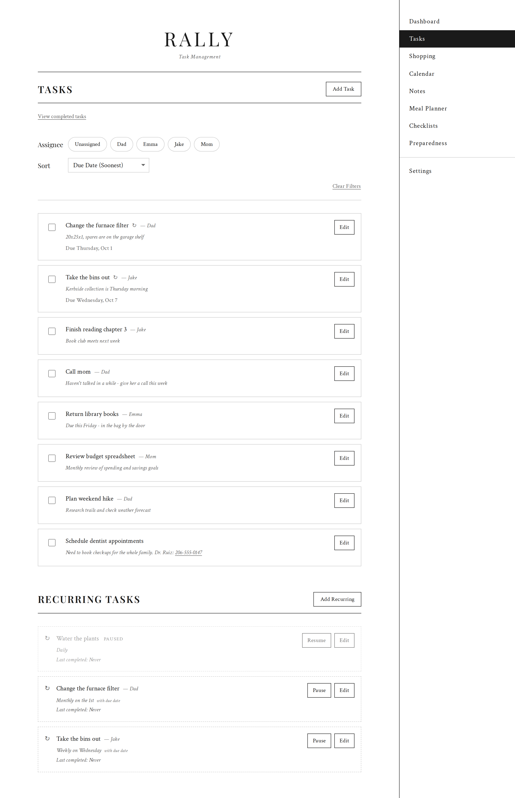
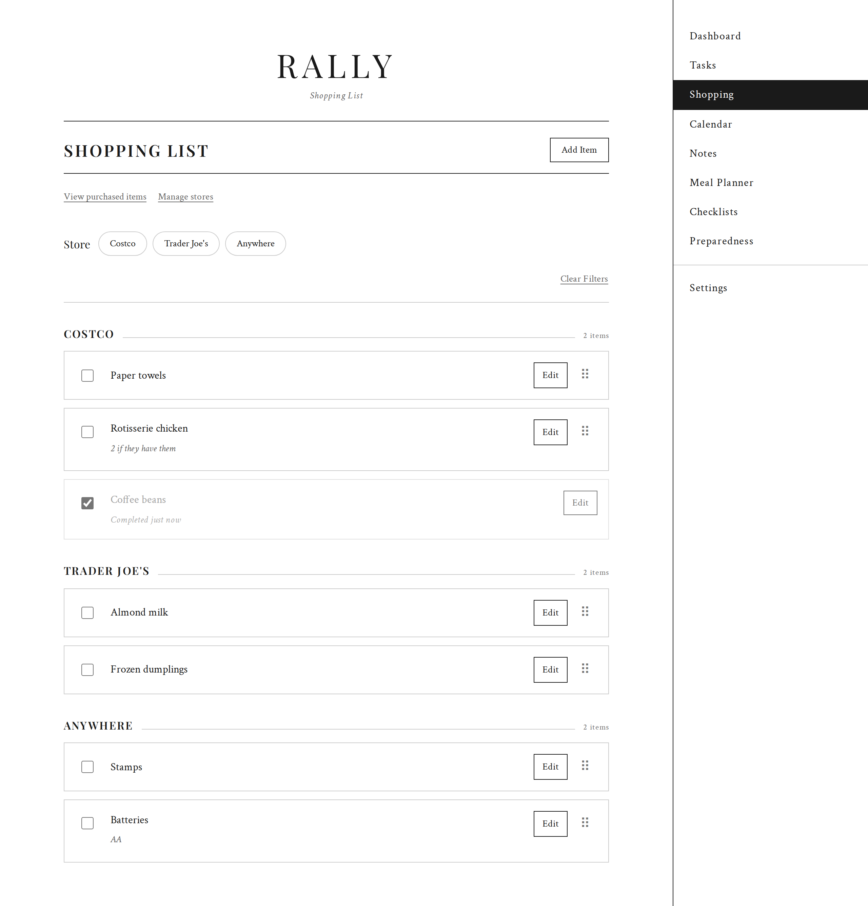
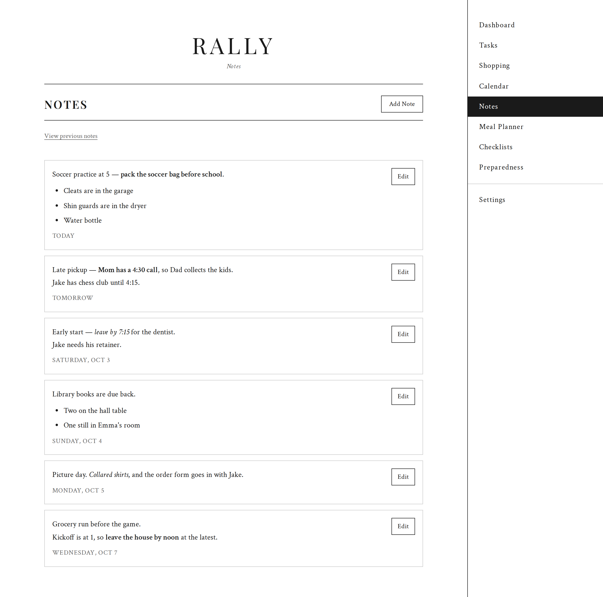
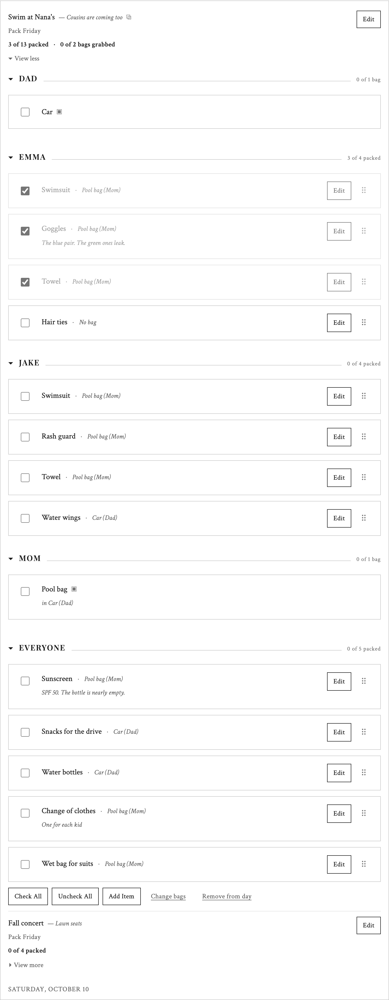
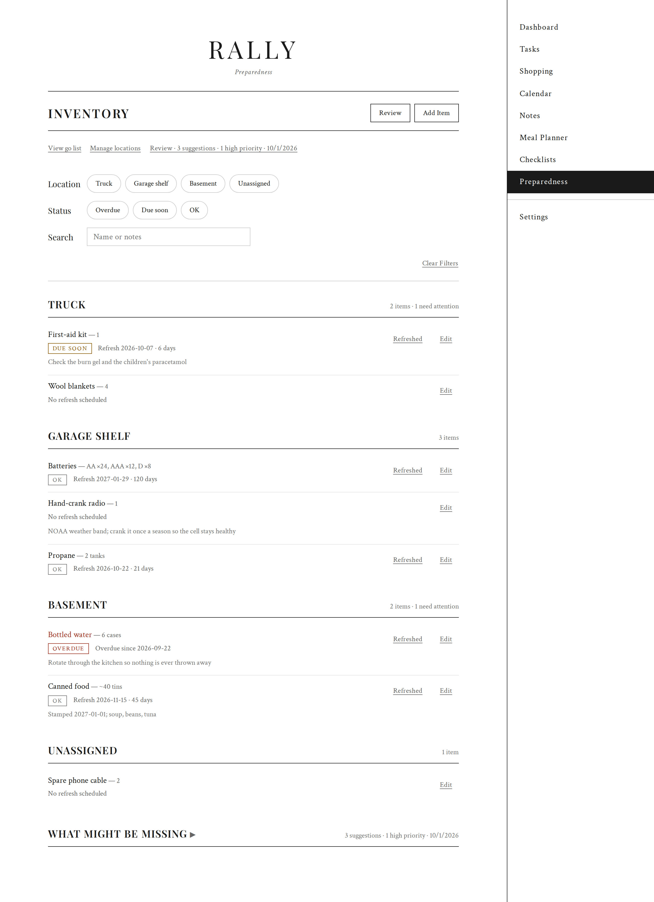
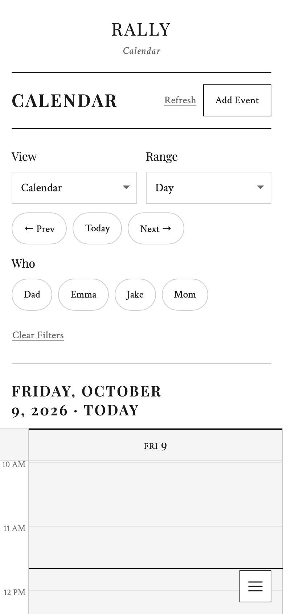

# Rally

**Your family's command center: one shared plan for the day, on every screen in the house.**

Rally is a self-hosted app for family logistics. Who is going where, what has to get done, what needs buying, and what is in the emergency kit. Every morning it reads your calendars, the weather forecast and your lists, and writes one short briefing for the whole family. The rest of the day it is the shared calendar, the task list, the shopping list and the stock inventory that the briefing was built from.

It runs on your own hardware. Your family's schedule stays in the house, apart from what goes to the AI provider you choose.



## Watch the tour

A ten-minute walk through the whole app, recorded against a seeded demo instance.

<video src="https://github.com/user-attachments/assets/5c63ade2-e276-4239-afb2-73626440a270" controls muted playsinline>
  <a href="https://github.com/pid1/rally/releases/download/demo-2026-08-17/rally-demo.mp4"></a>
</video>

You can run the same demo instance yourself in about a minute: see [docs/development.md](docs/development.md#the-demo-instance).

## What Rally does

### One briefing, every morning

At 4 AM Rally gathers the day's events, the forecast, the tasks that are due and tonight's dinner, then asks the AI model of your choosing to write the family a short plan in plain language. The page is served from a cache, so the kitchen display never sits waiting on an API.

You can fold in more if you want it: your open shopping list, the packing lists you need to pack this week, anything overdue in your emergency stock, tonight's games for the teams you follow, a STEM idea for the kids. Each one is a toggle in Settings.

### A calendar the whole family shares

Rally holds your family's own events and shows them beside the calendars you already use, whether that's Google, iCloud, or any ICS feed. There are day, week, month and agenda views, color-coded by person, with recurring events and per-occurrence edits (just this Tuesday, or every Tuesday from now on).

Each person can say which of those the calendar should open on, **per device** — the kitchen display and the laptop are the same width and want opposite things. Rally has no logins, so a browser simply says who is using it and remembers its own answers; a shared screen says nobody and keeps the defaults. See [Personal defaults](docs/configuration.md#personal-defaults).



When somebody adds, moves or cancels an event, the people on that event get a push notification. The household doesn't. Reminders work the same way: put a lead time on an event and only its attendees hear about it.

### Tasks and shopping

Tasks can belong to a person, carry a due date, and repeat daily, weekly or monthly. Hand one to somebody and their phone gets a push — theirs alone, once, when it becomes theirs. Completed ones stay on the page until midnight, so nobody has to wonder whether the bins went out.



The shopping list is built for fast entry. It autocompletes from what the family has bought before, remembers which shop each thing comes from, and groups the list by shop so one trip fits on one screen. You can add to it by voice through Siri: see **[docs/voice-shortcuts.md](docs/voice-shortcuts.md)**.



### A note for the day

Some things aren't a task, an event or a meal — they're a heads-up. *Soccer practice is at 5, so the bag needs packing before school.* Write one note per day, days ahead if you like, and it appears on the dashboard that morning between the weather and the schedule. Days without a note show nothing at all.

Notes take a little formatting — **bold**, *italic* and lists — and the dashboard reads them live, so a note added at breakfast is there on the next refresh rather than tomorrow. Past days move to a searchable archive and stop being editable.



### Packing lists for the things you pack again and again

Swim at Nana's, a beach day, the school backpacks, Dad's work bag: keep each packing list once as a template and put it on a day whenever you need it. Packing for something that only happens once, like a concert or a day at a theme park? Add a list just for that day, blank or started from a copy of a template. Every item can belong to someone and go in a bag, so you can read any list by who's packing what or by what goes in each bag. Bags can belong to someone too, and go inside other bags (the toiletries bag in the suitcase), so each person's part of the list starts with the bags they need to grab on the way out the door, and you can tick those off as well. Rally remembers what you've packed before so items fill themselves in, with the things you pack most suggested first. Checking things off for Saturday never touches next week's list, and anything you add to the template shows up on every day it's on. Need something extra just this once, skipping the swimsuit this time, or packing in a different order? Change that day's list and the template stays as it was. Adding an event to the calendar? Bring its packing lists along right there: they go on the event's day, move when the event moves, and come off when it's canceled, even one Tuesday of a repeating event. A list you pack on a routine, like the school backpack every weekday, can also repeat on its own schedule, and past days stay in a read-only archive, even after you delete the template they came from.

The morning briefing reminds you on the packing day (as many days ahead as each list needs), names who still has what to pack and which bag it goes in, and points out what might need restocking or be hard to find at the last minute, like a nearly empty bottle of sunscreen.



### Emergency stock

Track what is in the kit, where it lives, and when it needs replacing. A replacement date can be fixed (this case is stamped 2027-01-01) or a rotation (swap the water every six months). Rally pushes one digest a day covering everything due, keeps mentioning anything overdue in the morning briefing, and prints a go list grouped by location in the order you walk it.



### On a phone

Every page is built for a phone first and scales up to a wall display. The design is grayscale and typographic, so it also reads well on e-ink. A phone number written into a task, a note or an event is a link: tap it and the phone dials.



## Getting started

Rally ships as a Docker container:

```bash
docker run -d \
  -p 8000:8000 \
  -v $(pwd)/data:/data \
  --name rally \
  --restart unless-stopped \
  ghcr.io/pid1/rally:latest
```

Open `http://localhost:8000/settings` and fill in your timezone, your family members, an AI provider key and a weather forecast URL. Everything else is optional and can be added later.

Full instructions, including what you need before you start: **[docs/installation.md](docs/installation.md)**.

## Documentation

| Guide | What's in it |
|---|---|
| [Installation](docs/installation.md) | Requirements, Docker deployment, upgrades, environment variables |
| [Configuration](docs/configuration.md) | Settings UI, AI providers, weather, calendars, Pushover notifications |
| [Voice shortcuts](docs/voice-shortcuts.md) | Adding shopping items with Siri and Apple Shortcuts |
| [Backups](docs/backup.md) | Scheduled, client-side-encrypted offsite backup |
| [Development](docs/development.md) | Local setup, commands, tests, database migrations, the demo instance |
| [Design system](docs/visual-design-system.md) | Typography, spacing, components and how they are enforced |

## Contributing

Pull requests are welcome. Run `check` and the test suite before submitting, as described in [docs/development.md](docs/development.md).

If you are an AI agent working in this repository, read **[AGENTS.md](AGENTS.md)** first.

## License

BSD 3-Clause. See [LICENSE](LICENSE).
