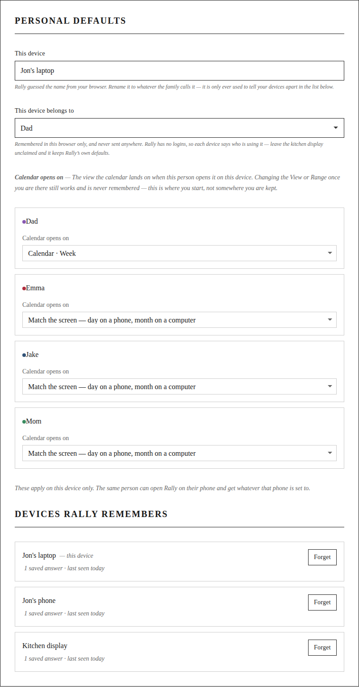
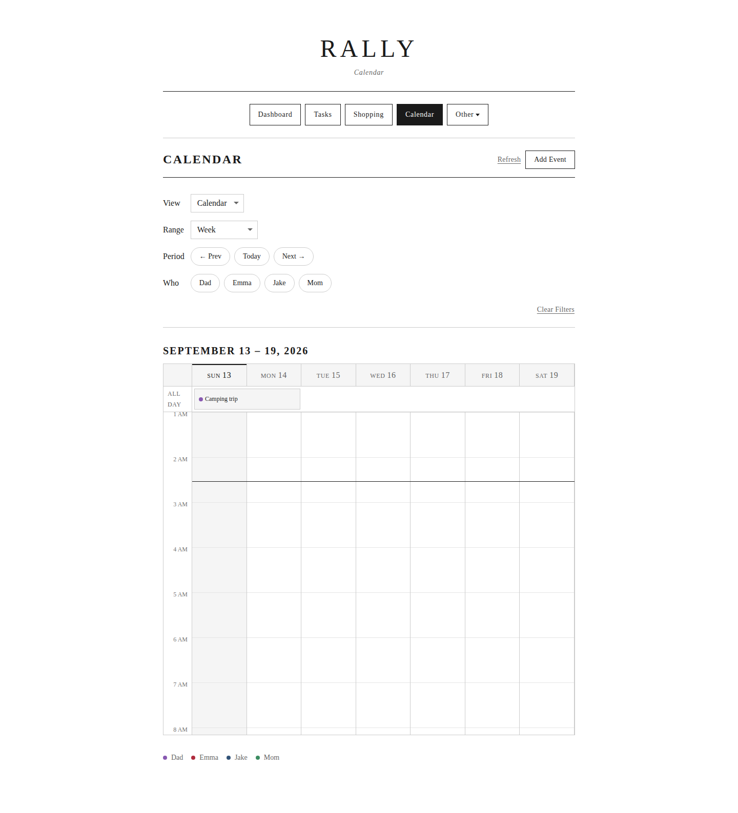
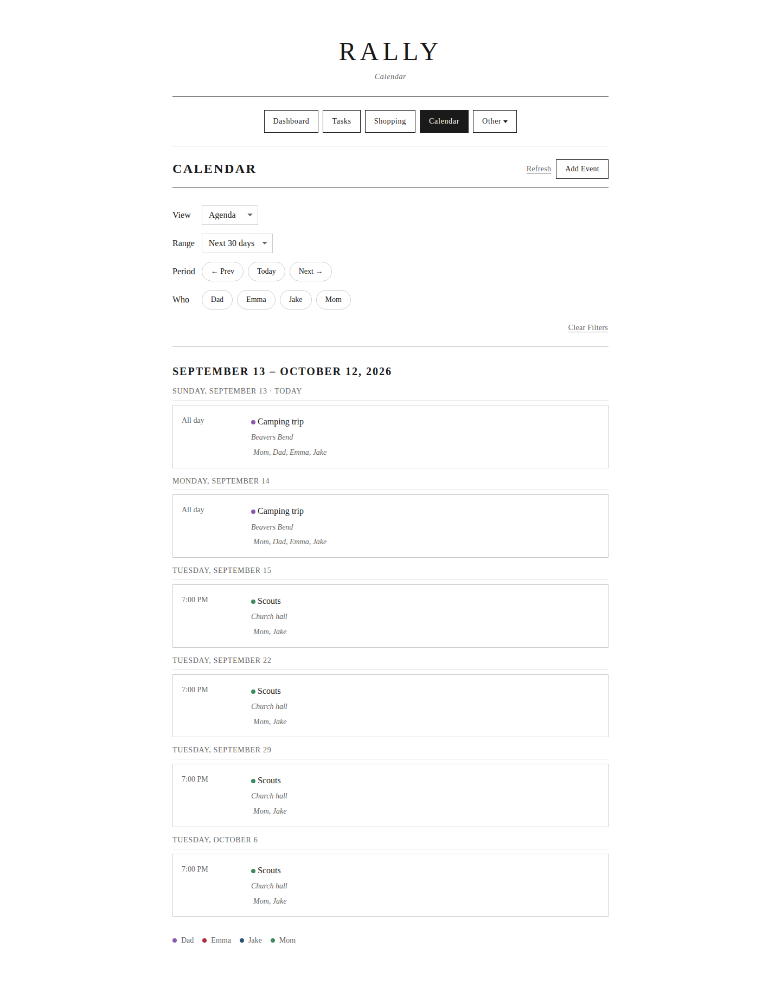
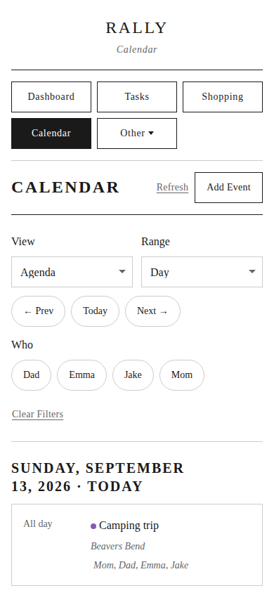

# Configuration

Almost everything is configured on the **Settings** page and stored in the database. A `config.toml` file is supported as a fallback for API keys, calendar URLs and coordinates. Where both exist, the database wins.

Rally verifies LLM, weather, calendar and followed-team settings as you save them, and shows the result in a modal, so a wrong key fails in front of you rather than at 4 AM.

## The AI briefing

Pick a provider in Settings → **LLM**:

- **Anthropic.** An API key and a model. The token budget can be set explicitly, or resolved from the model's real maximum at save time.
- **OpenAI-compatible.** Any endpoint that speaks the OpenAI API, including a local server such as LM Studio or Ollama. GLM 4.7 Flash is a good local choice.

Two free-text fields shape what the model writes:

| Field | What it is for |
|---|---|
| **Family context** | Who is in the family, ages, routines, what matters. The model reads this every run |
| **Agent voice** | The tone to write in |

Both are versioned. Every save records a snapshot, and **Version History** rolls either one back without touching the other. The same applies to the LLM provider, model and token budget, which are versioned together as one coupled snapshot: rolling back restores all of it at once.

**Home location**, for example "Highland Village, TX", is sent to the model as its own block, so the briefing can reason about local conditions.

## Weather

Rally reads the National Weather Service DWML feed. Paste your forecast URL into Settings → **Weather**; the section explains how to find it for your coordinates. No API key is involved.

## Calendars

Add calendars under Settings → **Calendars**, each linked to a family member so its events carry that person's color.

Every family member also gets a **Rally-owned calendar** automatically. Events you create in Rally live there. External calendars are read-only.

**ICS feed.** For public calendar URLs that need no authentication. Paste the URL.

**Google CalDAV.** Uses an app-specific password:

1. Enable 2-Step Verification at [myaccount.google.com/security](https://myaccount.google.com/security)
2. Go to [myaccount.google.com/apppasswords](https://myaccount.google.com/apppasswords)
3. Choose "Other" and name it something like `Rally`
4. Copy the 16-character password
5. In Rally, add a calendar of type **Google CalDAV** with your Gmail address and that password

**Apple iCloud CalDAV.** Also an app-specific password:

1. Enable Two-Factor Authentication at [appleid.apple.com](https://appleid.apple.com)
2. Go to [appleid.apple.com/account/manage](https://appleid.apple.com/account/manage)
3. Under "Sign-In and Security", choose **App-Specific Passwords**
4. Generate one labeled `Rally` and copy it
5. In Rally, add a calendar of type **Apple iCloud CalDAV** with your Apple ID and that password

External calendars are fetched in the background and served from a cache, so pages render immediately. `calendar_sync_interval_minutes` (default 5) sets how stale that cache may get. The calendar page says how old the data is, and names any feed it could not reach.

If a provider rate-limits a feed (HTTP 429, or the 503 some hosts send instead), that one calendar backs off before it is tried again — for as long as the server's `Retry-After` asks, or doubling from five minutes up to four hours when it does not say. The other calendars keep syncing on the normal interval, and the **Refresh** button on the calendar page ignores the backoff, because a person pressing it is not the traffic being throttled.

## Personal defaults

Settings → **Personal Defaults** is where each family member says how Rally should behave for them — **on the device they are setting it from**.

Rally has no sign-in. It is one household on one network, and the tablet on the kitchen wall that nobody is signed in to is the normal case rather than an edge one. So a device says who is using it: pick yourself in **This device belongs to**, and that browser applies your defaults from then on. The choice is remembered in that browser alone and is never sent anywhere; leave a shared screen on *Nobody in particular* and it keeps Rally's own defaults.

**Everything here applies to that one device.** The settings you change on the kitchen display stay on the kitchen display — open Rally on your phone and you get whatever the phone is set to. That is deliberate: "phone or computer" is a guess about a device dressed up as a fact about one, and the wall tablet and the desk laptop are the same width and want opposite things.

| Setting | Choices | Default |
|---|---|---|
| Calendar opens on | **Match the screen**, or Calendar/Agenda crossed with Day, Week, Month, and (Agenda only) Next 30 days | Match the screen |

**Match the screen** is Rally's own rule and what every device gets until somebody changes it: a phone-width screen opens the calendar on the day, a wider one on the month. It is a real option rather than only the absence of one, so a device can be handed the decision back after having been given a specific view. Because it is the default, upgrading moves nobody's screen.

This sets where the calendar **starts**, not where it keeps you. Changing `View` or `Range` once you are there still works and is still never remembered — which calendar you want next is a function of why you opened it, and a remembered Day view is exactly wrong for the Sunday planning session.

A grid cannot draw *Next 30 days*, so that range is offered under Agenda only.



### Devices Rally remembers

Each browser names itself the first time it opens Rally — a coarse guess like *iPhone* or *Mac* — and **This device** renames it to whatever the family calls it. The list at the foot of the section shows every device Rally has heard from, how many answers each one carries, and when it was last seen.

**Forget** clears a device and its saved answers. That list is not decoration: a browser that clears its site data comes back as a new device and leaves its old answers behind, so without somewhere to see and drop them they accumulate where nobody can reach them. A forgotten device that comes back is simply a device with no settings.

### The same person, three of their devices

All three of these are the same family member, and the first two are the same width. A per-form-factor setting could not tell them apart; a per-device one does.

**Jon's laptop** opens on the week grid:



**The kitchen display**, at the same width, opens on the next thirty days:



**Jon's phone** opens on today:



## Notifications

Rally uses [Pushover](https://pushover.net). Settings → **Notifications** takes the application token that identifies your install. Each family member's own user key goes on their profile in Settings → **Family**.

A member without a key is never notified. That is the default rather than an error.

Five kinds of push, each with its own audience rule:

| Kind | Fires when | Goes to | Default | Install-wide switch |
|---|---|---|---|---|
| Event reminders | An event's lead time arrives, or somebody presses **Notify attendees** | The event's attendees | On | — |
| Calendar additions and changes | A Rally event is added, changed or deleted | The event's attendees | On | — |
| Task hand-offs | A task is created for somebody or handed to them | That one assignee | On | Settings → **Tasks** |
| Preparedness refresh digest | Daily, at the configured time | Everybody with a key | On | Settings → **Preparedness** |
| Shopping list additions | Items are added to the list | Whoever opted in | **Off** | Settings → **Shopping List** |

The event kinds go to the event's **attendees** rather than to the whole household. Buzzing four phones about one child's appointment is how a family learns to ignore notifications.

A task assignment goes to the assignee alone, once, at the moment the task becomes theirs. A task assigned to Everyone pushes to nobody, editing a task somebody already has is silent, and recurring instances are never announced — the hand-over happened when you wrote the recurring task, not every morning since.

### Who hears what

Each family member chooses which kinds they get, in **Notify … about** on their own record in Settings → **Family Members**. A tick only ever *narrows* what that person already receives: turning on **Event reminders** does not start sending you other people's appointments. Somebody with no Pushover key keeps whatever they have set — the switches are held and explained rather than silently ineffective, and they take effect the moment a key is added.

Settings → **Notifications** lists every kind with its audience rule and who currently receives it, including who has muted it and who has no key. It is read-only: one screen answers *"why didn't I get that?"*, and the place to change an answer is the person's own record.

### Shopping list additions

A shopping list belongs to the household, so this is the one kind with no audience of its own — it goes only to the people who asked. Turn it on in Settings → **Shopping List**; it is off after an upgrade until somebody does.

Additions are **batched**. Nine things added while walking the pantry is one push, not nine: Rally waits for the adding to stop before it sends, and the wait is the **Wait for adding to stop** setting (`shopping_notify_settle_minutes`, default 5). An item added and purchased inside that window is never announced, which is correct — it was already bought. Purchases, edits, deletions and reordering are never announced; a notification when the list gets *shorter* is nobody's news.

Rally has no sign-in, so it cannot know who added an item: whoever opted in hears about their own adds too.

Preparedness has its own daily digest, with its own time and lead-time settings.

## Optional briefing sections

Each of these is a toggle in Settings:

| Toggle | Default | Effect |
|---|---|---|
| Shopping list in summary | Off | Folds your open shopping list into the morning briefing |
| Overdue stock in summary | On | Mentions preparedness items past their refresh date |
| STEM concept of the day | Off | Adds one age-appropriate STEM idea, never repeating a topic within 60 days |
| Sports watchlist | Off | Tonight's games and notable events for teams you follow |
| AI inventory review | Off | Adds a **Review** button to Preparedness that asks your model what the kit is missing |

## Context files

For file-based setup, copy the examples in the repository root:

- `config.toml.example` → `config.toml` for API keys, calendar URLs and coordinates
- `context.txt.example` → `context.txt` for family context
- `agent_voice.txt.example` → `agent_voice.txt` for voice and tone

The Settings UI is the recommended path. These exist for people who would rather keep configuration in files.

## Dashboard refresh interval

The dashboard reloads itself every 30 minutes. To change that, edit the timeout at the bottom of `templates/dashboard.html`:

```javascript
setTimeout(function() { location.reload(); }, 30 * 60 * 1000);
```
